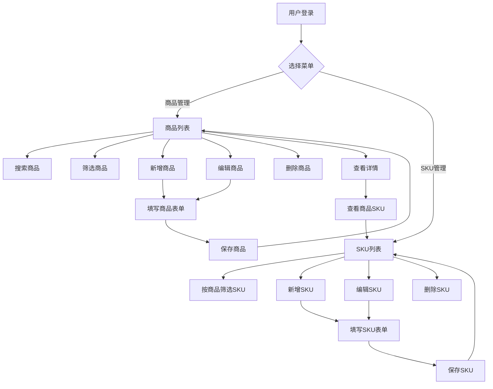

# 服装进销存系统 - 产品需求文档（第一阶段）

## 1. 产品概述

一款面向服装零售企业的进销存管理系统，帮助商家高效管理商品信息和SKU库存。
- 主要功能包括商品档案管理、SKU规格管理，支持多规格商品的统一管理
- 目标用户为服装批发商、零售商及电商卖家

## 2. 核心功能

### 2.1 用户角色
| 角色 | 注册方式 | 核心权限 |
|------|----------|----------|
| 管理员 | 系统预设 | 商品管理、SKU管理、数据查看 |

### 2.2 功能模块

#### 2.2.1 商品管理模块
1. **商品列表页**：展示所有商品信息，支持搜索、筛选、分页
2. **商品新增页**：录入商品基础信息（款号、名称、分类、品牌等）
3. **商品编辑页**：修改商品信息
4. **商品详情页**：查看商品完整信息及关联SKU

#### 2.2.2 SKU管理模块
1. **SKU列表页**：展示所有SKU，支持按商品筛选
2. **SKU新增页**：为指定商品添加SKU（颜色、尺码、价格等）
3. **SKU编辑页**：修改SKU信息
4. **商品SKU页**：查看某个商品下的所有SKU

### 2.3 页面详情

| 页面名称 | 模块名称 | 功能描述 |
|----------|----------|----------|
| 商品列表 | 商品管理 | 表格展示商品，支持搜索、筛选、分页、新增/编辑/删除操作 |
| 商品表单 | 商品管理 | 表单录入商品信息，包含图片上传 |
| 商品详情 | 商品管理 | 展示商品完整信息，可查看关联SKU |
| SKU列表 | SKU管理 | 表格展示SKU，支持按商品筛选、分页、增删改查 |
| SKU表单 | SKU管理 | 表单录入SKU信息（颜色、尺码、价格、库存等） |

## 3. 核心流程

### 3.1 商品管理流程
用户进入系统 → 左侧菜单选择"商品管理" → 查看商品列表 → 可进行搜索/筛选/分页 → 点击"新增"创建商品 → 填写表单提交 → 返回列表查看

### 3.2 SKU管理流程
用户进入系统 → 左侧菜单选择"SKU管理" → 查看SKU列表 → 可按商品筛选 → 点击"新增SKU" → 选择所属商品 → 填写SKU信息 → 提交保存



## 4. 用户界面设计

### 4.1 设计风格
- **主色调**：深蓝灰色系（#1e293b 为主色，#3b82f6 为强调色）
- **辅助色**：浅灰背景（#f8fafc）、白色卡片、绿色成功、红色危险
- **按钮样式**：圆角矩形（border-radius: 6px），主按钮使用强调色
- **字体**：系统默认字体，中文优先使用系统字体栈
- **布局风格**：左侧固定导航栏 + 右侧内容区，卡片式布局
- **图标**：使用 Lucide React 图标库

### 4.2 页面设计概述

| 页面名称 | 模块名称 | UI元素 |
|----------|----------|--------|
| 商品列表 | 商品管理 | 搜索框、筛选下拉框、表格（分页）、操作按钮（新增/编辑/删除/查看） |
| 商品表单 | 商品管理 | 表单输入框、下拉选择、图片上传组件、提交/取消按钮 |
| 商品详情 | 商品管理 | 信息展示卡片、图片展示、关联SKU列表 |
| SKU列表 | SKU管理 | 商品筛选器、表格（分页）、操作按钮 |
| SKU表单 | SKU管理 | 商品选择器、颜色/尺码输入、价格输入、库存输入 |

### 4.3 响应式设计
- **桌面端**：左侧固定 240px 导航栏，右侧内容区自适应
- **平板端**：左侧收缩导航栏（仅图标），内容区自适应
- **手机端**：底部标签栏导航，页面内容全屏展示，表格支持横向滚动

### 4.4 导航结构
```
左侧菜单（桌面端）
├── 商品管理
└── SKU管理

底部导航（手机端）
├── 商品
└── SKU
```

## 5. 数据模型

### 5.1 商品表（products）
| 字段名 | 类型 | 说明 |
|--------|------|------|
| id | uuid | 主键 |
| product_code | varchar | 款号，唯一 |
| name | varchar | 商品名称 |
| category | varchar | 分类 |
| brand | varchar | 品牌 |
| season | varchar | 季节 |
| image_url | text | 商品图片URL |
| status | varchar | 状态（上架/下架）|
| created_at | timestamp | 创建时间 |

### 5.2 SKU表（product_skus）
| 字段名 | 类型 | 说明 |
|--------|------|------|
| id | uuid | 主键 |
| product_id | uuid | 关联商品ID |
| color | varchar | 颜色 |
| size | varchar | 尺码 |
| barcode | varchar | 条码 |
| cost_price | decimal | 成本价 |
| sale_price | decimal | 销售价 |
| warning_stock | int | 安全库存 |
| current_stock | int | 当前库存 |
| created_at | timestamp | 创建时间 |
