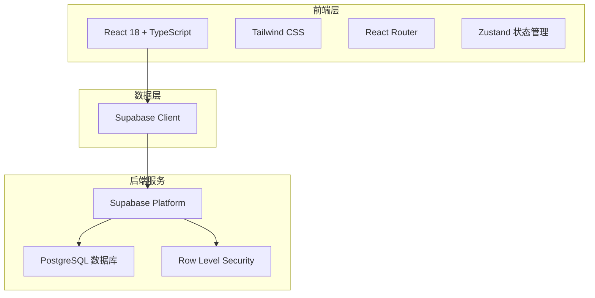
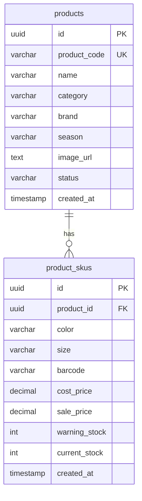

# 服装进销存系统 - 技术架构文档

## 1. 架构设计



## 2. 技术描述

### 2.1 前端技术栈
- **框架**：React 18 + TypeScript
- **构建工具**：Vite
- **样式**：Tailwind CSS 3
- **路由**：React Router DOM v6
- **状态管理**：Zustand
- **图标**：Lucide React
- **UI组件**：Headless UI（可选）

### 2.2 后端服务
- **平台**：Supabase
- **数据库**：PostgreSQL
- **认证**：Supabase Auth（预留）
- **存储**：Supabase Storage（用于图片）
- **实时**：Supabase Realtime（预留）

### 2.3 项目初始化
- **模板**：react-ts（Vite + React + TypeScript）
- **包管理器**：npm/pnpm

## 3. 路由定义

| 路由 | 用途 | 组件 |
|------|------|------|
| / | 重定向到商品管理 | Navigate |
| /products | 商品列表页 | ProductList |
| /products/new | 新增商品页 | ProductForm |
| /products/:id/edit | 编辑商品页 | ProductForm |
| /products/:id | 商品详情页 | ProductDetail |
| /skus | SKU列表页 | SkuList |
| /skus/new | 新增SKU页 | SkuForm |
| /skus/:id/edit | 编辑SKU页 | SkuForm |

## 4. 数据模型

### 4.1 ER图



### 4.2 数据定义语言（DDL）

```sql
-- 商品表
CREATE TABLE products (
    id UUID PRIMARY KEY DEFAULT gen_random_uuid(),
    product_code VARCHAR(50) UNIQUE NOT NULL,
    name VARCHAR(200) NOT NULL,
    category VARCHAR(100),
    brand VARCHAR(100),
    season VARCHAR(50),
    image_url TEXT,
    status VARCHAR(20) DEFAULT '上架' CHECK (status IN ('上架', '下架')),
    created_at TIMESTAMP WITH TIME ZONE DEFAULT NOW()
);

-- SKU表
CREATE TABLE product_skus (
    id UUID PRIMARY KEY DEFAULT gen_random_uuid(),
    product_id UUID NOT NULL REFERENCES products(id) ON DELETE CASCADE,
    color VARCHAR(50) NOT NULL,
    size VARCHAR(50) NOT NULL,
    barcode VARCHAR(100),
    cost_price DECIMAL(10, 2) DEFAULT 0,
    sale_price DECIMAL(10, 2) DEFAULT 0,
    warning_stock INTEGER DEFAULT 0,
    current_stock INTEGER DEFAULT 0,
    created_at TIMESTAMP WITH TIME ZONE DEFAULT NOW(),
    UNIQUE(product_id, color, size)
);

-- 索引
CREATE INDEX idx_products_code ON products(product_code);
CREATE INDEX idx_products_name ON products(name);
CREATE INDEX idx_products_category ON products(category);
CREATE INDEX idx_products_status ON products(status);
CREATE INDEX idx_skus_product_id ON product_skus(product_id);
CREATE INDEX idx_skus_barcode ON product_skus(barcode);

-- 启用RLS（行级安全）
ALTER TABLE products ENABLE ROW LEVEL SECURITY;
ALTER TABLE product_skus ENABLE ROW LEVEL SECURITY;

-- 创建允许所有操作的策略（开发阶段）
CREATE POLICY "Allow all" ON products FOR ALL USING (true) WITH CHECK (true);
CREATE POLICY "Allow all" ON product_skus FOR ALL USING (true) WITH CHECK (true);
```

## 5. 项目结构

```
进销存/
├── .trae/
│   └── documents/
│       ├── PRD.md
│       └── Technical-Architecture.md
├── src/
│   ├── components/          # 公共组件
│   │   ├── Layout.tsx       # 布局组件
│   │   ├── Sidebar.tsx      # 侧边栏
│   │   ├── MobileNav.tsx    # 移动端导航
│   │   ├── DataTable.tsx    # 数据表格
│   │   ├── Pagination.tsx   # 分页组件
│   │   ├── SearchInput.tsx  # 搜索输入
│   │   ├── ConfirmDialog.tsx # 确认对话框
│   │   └── ImageUpload.tsx  # 图片上传
│   ├── pages/               # 页面组件
│   │   ├── products/
│   │   │   ├── ProductList.tsx
│   │   │   ├── ProductForm.tsx
│   │   │   └── ProductDetail.tsx
│   │   └── skus/
│   │       ├── SkuList.tsx
│   │       └── SkuForm.tsx
│   ├── hooks/               # 自定义Hooks
│   │   ├── useProducts.ts
│   │   └── useSkus.ts
│   ├── stores/              # Zustand状态
│   │   ├── productStore.ts
│   │   └── skuStore.ts
│   ├── lib/                 # 工具库
│   │   ├── supabase.ts      # Supabase客户端
│   │   └── utils.ts         # 工具函数
│   ├── types/               # TypeScript类型
│   │   └── index.ts
│   ├── App.tsx
│   ├── main.tsx
│   └── index.css
├── public/
├── index.html
├── package.json
├── tailwind.config.js
├── tsconfig.json
└── vite.config.ts
```

## 6. Supabase配置

### 6.1 环境变量
```
VITE_SUPABASE_URL=your_supabase_project_url
VITE_SUPABASE_ANON_KEY=your_supabase_anon_key
```

### 6.2 客户端初始化
```typescript
import { createClient } from '@supabase/supabase-js'

const supabaseUrl = import.meta.env.VITE_SUPABASE_URL
const supabaseKey = import.meta.env.VITE_SUPABASE_ANON_KEY

export const supabase = createClient(supabaseUrl, supabaseKey)
```

## 7. 响应式断点

| 断点 | 宽度 | 布局 |
|------|------|------|
| sm | 640px | 手机横屏 |
| md | 768px | 平板 |
| lg | 1024px | 小桌面 |
| xl | 1280px | 桌面 |

### 7.1 布局适配
- **< 768px**：底部导航栏，全屏内容，表格横向滚动
- **768px - 1024px**：左侧收缩导航（图标模式）
- **> 1024px**：左侧展开导航（240px），内容区自适应
